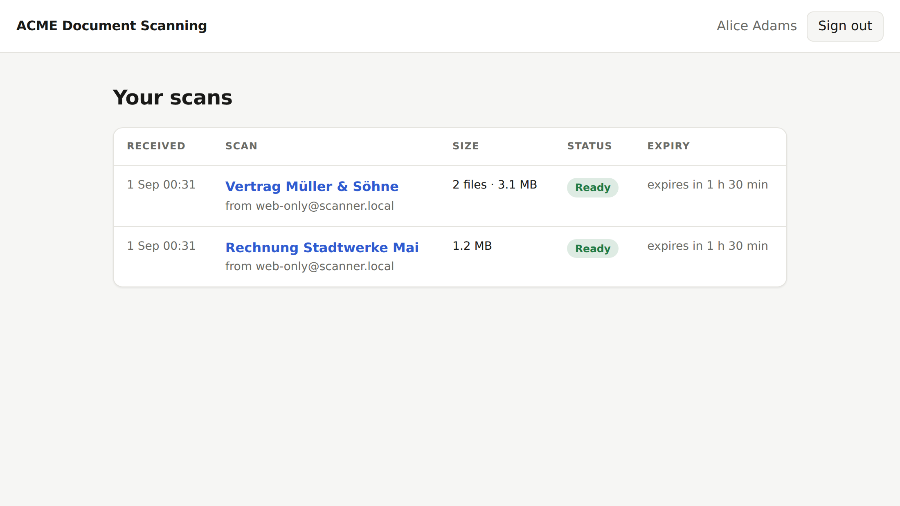

# scan2graph

A small, self-contained LAN gateway that turns "scan to email" from old
printers/scanners into modern document delivery: it accepts the printer's SMTP
message, extracts the PDF attachments, optionally runs them through Azure
Document Intelligence OCR (searchable PDF), and then either sends them onwards
with Microsoft Graph, exposes them temporarily in a small Entra-authenticated
web UI, or both.

Many multifunction printers can only speak unauthenticated SMTP to a server on
the local network. Microsoft 365 no longer accepts that. scan2graph is the
missing piece in between — one container, no database, no queue, no persistent
state.

## How it works

```
┌─────────┐  SMTP :25→:2525   ┌──────────────────────┐  Azure Document Intelligence
│ printer │ ────────────────► │                      │ ◄──► prebuilt-read, searchable PDF
└─────────┘                   │      scan2graph      │
                              │  (single container)  │  Microsoft Graph
┌─────────┐  HTTPS            │                      │ ◄──► sendMail (MIME)
│ browser │ ──► reverse proxy ─► HTTP :8080          │
└─────────┘     (TLS here)    └──────────────────────┘
```

1. The printer sends the scan to scan2graph over plain LAN SMTP.
2. The **SMTP envelope sender** selects a *sender profile*, i.e. what should
   happen with the scan.
3. The **SMTP envelope recipients** identify the *people* the scan is for.
4. PDFs are extracted, optionally OCRed, and then mailed via Microsoft Graph
   and/or offered for download in the web UI for a limited time.


The header and the page title follow `S2G_UI_TITLE`, so the appliance can go by
the household's or the office's own name:



## Sender profiles vs. recipient identity

Printers usually offer two independent address books: the "from" address of the
device and a list of destination addresses. scan2graph uses them for two
different purposes, and it never looks at the MIME `From:`/`To:` headers.

* **Envelope sender → feature profile.** Configure one printer sender address
  per feature combination, for example `scan-web-ocr@scanner.local`. Once
  profiles are configured, unknown senders are rejected. Profiles are
  optional: with none configured, every sender gets the same treatment, and
  each capability is on exactly when the configuration it needs is present —
  email once a Graph sender and a recipient-domain allowlist are configured,
  web downloads once the public base URL is, OCR once the Document
  Intelligence endpoint is. scan2graph prints the resulting profile at
  startup, so it is never a mystery why a feature is off.
* **Envelope recipients → users.** The recipient addresses are matched against
  the signed-in Entra user (email / UPN, plus an optional alias mapping for
  printers that can only store shortened addresses).

A profile is a combination of three independent capabilities:

| capability | effect                                                        |
| ---------- | ------------------------------------------------------------- |
| `ocr`      | run each PDF through Azure Document Intelligence (searchable PDF) |
| `email`    | send the resulting PDFs via Microsoft Graph to the recipients  |
| `web`      | make the resulting PDFs downloadable in the web UI for a while |

```json
{
  "scan-email-ocr@scanner.local": { "email": true,  "web": false, "ocr": true  },
  "scan-web-ocr@scanner.local":   { "email": false, "web": true,  "ocr": true  },
  "scan-web@scanner.local":       { "email": false, "web": true,  "ocr": false }
}
```

The recipient-domain allowlist (`S2G_ALLOWED_RECIPIENT_DOMAINS`) is checked
for every recipient of every profile, not only the ones a profile ends up
emailing — a web-only scan to someone outside the allowed domains is rejected
at SMTP time just the same. It is only *required* when something can send
email, though: a web-only deployment that leaves it unset accepts any
recipient address at all, which is fine for a printer on your own LAN but
not a filter you have configured.

## Setting up the printer

Point the printer's "scan to email" feature at scan2graph:

* **SMTP server**: scan2graph's host, on the LAN.
* **Port**: whatever `S2G_SMTP_ADDR` listens on (`2525` by default — the
  container runs unprivileged and cannot bind port 25 itself; forward it at
  the network layer if the printer insists on 25).
* **Encryption**: none. The listener never advertises STARTTLS; see "Security
  assumptions" for why that is an accepted trade-off on a LAN segment.
* **Authentication**: PLAIN or LOGIN, with `S2G_SMTP_USERNAME` /
  `S2G_SMTP_PASSWORD` (username defaults to `scanner`; leaving the password
  unset makes scan2graph generate a fresh one and print it on every start,
  which is fine for trying things out but not for a printer profile you want
  to survive a restart). `S2G_SMTP_ALLOW_ANONYMOUS=true` turns AUTH off
  entirely — only do that on a fully trusted, isolated segment.
* **From address**: this is the sender-profile address from the table above —
  configure one printer "scan to" button per feature combination you want.
* **To address(es)**: the recipients — see "Sender profiles vs. recipient
  identity" above.

## Entra ID app registration

scan2graph needs exactly one Entra app registration. It serves both the web
UI's sign-in (authorization code flow with PKCE) and the app-only tokens used
to call Microsoft Graph and Azure Document Intelligence (client credentials
flow) — there is nothing to register twice. Steps 1 and 3 are always needed;
2 and 4 depend on what your profiles actually do.

1. **Microsoft Entra ID → App registrations → New registration.** A
   single-tenant app is enough. Note the **Directory (tenant) ID** and
   **Application (client) ID** from the Overview page —
   `S2G_ENTRA_TENANT_ID` and `S2G_ENTRA_CLIENT_ID`.
2. **Only if a profile offers web downloads** (i.e. you configure
   `S2G_PUBLIC_BASE_URL`): **Authentication → Add a platform → Web**,
   redirect URI `https://<your host>/auth/callback` (that base URL plus
   `/auth/callback`, exactly). Use the **Web** platform, not SPA or a public
   client — scan2graph holds a client secret and runs the code exchange
   server-side. An email-only deployment signs nobody in and needs no
   redirect URI at all.
3. **Certificates & secrets → New client secret.** The value is shown once;
   copy it into `S2G_ENTRA_CLIENT_SECRET` (or, preferably,
   `S2G_ENTRA_CLIENT_SECRET_FILE`).
4. **Only if a profile sends email** (i.e. you configure `S2G_GRAPH_SENDER`):
   **API permissions → Add a permission → Microsoft Graph → Application
   permissions → `Mail.Send`**, then **Grant admin consent**. This is what
   lets scan2graph's app-only token call `sendMail`. A web-only deployment
   never constructs a mailer and should not be granted it. Sign-in itself
   needs no extra permission either: it only requests the standard OIDC
   `openid`, `profile` and `email` scopes, none of which need consent.

## Azure Document Intelligence

1. Create a **Document Intelligence** resource in the Azure Portal. Its
   endpoint, from the resource's Keys and Endpoint page, is
   `S2G_DI_ENDPOINT` (must be `https`).
2. scan2graph authenticates with the same app registration's app-only token,
   never a resource key, so the app registration needs the built-in
   **Cognitive Services User** role on that resource: resource → **Access
   control (IAM) → Add role assignment → Cognitive Services User**, assigned
   to the app registration by name. With that in place you can turn the
   resource's local (key-based) authentication off entirely.

## Reverse proxy

scan2graph never terminates TLS and never manages certificates — put a
reverse proxy (nginx, Caddy, Traefik, an existing ingress, ...) in front of
the HTTP port for that. Two things it has to get right:

* Give scan2graph **its own hostname** and proxy all of it — not a path
  prefix under an existing site. `S2G_PUBLIC_BASE_URL` must address the root
  of a host (it is what the OIDC redirect and every link on the page are
  built from); scan2graph refuses to start with a path in it.
* No forwarded-header handling is required: scan2graph never derives a URL
  from the incoming request, only from `S2G_PUBLIC_BASE_URL`.

## Configuration reference

Every `S2G_X` variable below may instead be set as `S2G_X_FILE`, pointing at
a file whose contents (trailing whitespace trimmed) become the value — the
way to feed in a secret via a Docker secret file without it ever being a
plain environment variable. Setting both at once is a startup error. See
[`.env.example`](.env.example) for a fully commented copy with example
values.

**Listeners, logging & appearance**

| variable | default | required when |
| --- | --- | --- |
| `S2G_HTTP_ADDR` | `:8080` | — |
| `S2G_SMTP_ADDR` | `:2525` | — |
| `S2G_TEMP_DIR` | the OS temp directory | — |
| `S2G_LOG_LEVEL` | `info` | — |
| `S2G_LOG_FORMAT` | `json` | — |
| `S2G_UI_TITLE` | `scan2graph` — the name the web UI goes by, in its page title and header; at most 60 characters | — |

**SMTP AUTH**

| variable | default | required when |
| --- | --- | --- |
| `S2G_SMTP_USERNAME` | `scanner` | only meaningful once a password is set |
| `S2G_SMTP_PASSWORD` | none — an ephemeral password is generated and printed on every start | set it for a deployment that must keep working across restarts |
| `S2G_SMTP_ALLOW_ANONYMOUS` | `false` | mutually exclusive with the two above |

**Sender profiles & recipient identity**

| variable | default | required when |
| --- | --- | --- |
| `S2G_PROFILES` | none — the default profile applies to every sender | — |
| `S2G_RECIPIENT_ALIASES` | `{}` | — |
| `S2G_ALLOWED_RECIPIENT_DOMAINS` | none | any profile (or the default profile) has `email` enabled |
| `S2G_PUBLIC_BASE_URL` | none — web UI disabled | any profile (or the default profile) has `web` enabled |

**Entra ID (identity) — always required**

| variable | default | required when |
| --- | --- | --- |
| `S2G_ENTRA_TENANT_ID` | none | always |
| `S2G_ENTRA_CLIENT_ID` | none | always |
| `S2G_ENTRA_CLIENT_SECRET` | none | always |
| `S2G_ENTRA_AUTHORITY_URL` | derived from the tenant id | override only to point at a local test IdP |
| `S2G_ENTRA_TOKEN_URL` | derived from the tenant id | override only to point at a local test IdP |

**Microsoft Graph**

| variable | default | required when |
| --- | --- | --- |
| `S2G_GRAPH_BASE_URL` | `https://graph.microsoft.com/v1.0` | — |
| `S2G_GRAPH_SCOPE` | `https://graph.microsoft.com/.default` | — |
| `S2G_GRAPH_SENDER` | none | any profile (or the default profile) has `email` enabled |

**Azure Document Intelligence**

| variable | default | required when |
| --- | --- | --- |
| `S2G_DI_ENDPOINT` | none | any profile (or the default profile) has `ocr` enabled; must be `https` |
| `S2G_DI_API_VERSION` | `2024-11-30` | — |
| `S2G_DI_SCOPE` | `https://cognitiveservices.azure.com/.default` | — |

**Lifetimes & limits**

| variable | default | required when |
| --- | --- | --- |
| `S2G_JOB_TTL` | `90m` (minimum `1m`) | — |
| `S2G_MAX_MESSAGE_BYTES` | `33554432` (32 MiB) — the SMTP DATA cap, which also bounds PDF size | — |
| `S2G_MAX_JOBS` | `32` — queued + in-flight + web-visible jobs | — |
| `S2G_MAX_CONCURRENT_JOBS` | `2` — pipeline workers, also the OCR concurrency cap | — |

A message's MIME structure has its own, non-configurable ceiling (at most 100
parts, 10 levels of nesting, 16 PDF attachments); a message over any of these
is rejected with SMTP `552`, the same code a too-large message gets.

## Deployment

```bash
cp .env.example .env   # then edit it — see the reference above
docker compose -f docker-compose.example.yml up -d
```

Copy [`docker-compose.example.yml`](docker-compose.example.yml) and edit it —
every setting in it is commented. Building the image yourself is `docker
build -t scan2graph .`.

## Security assumptions

* The SMTP listener is meant for a **restricted LAN segment** and speaks
  plain TCP without TLS, because that is all these devices can do. It does
  support SMTP AUTH (PLAIN/LOGIN); if you do not configure credentials,
  scan2graph generates an ephemeral password at startup and prints it.
  Running without authentication is possible but has to be opted into
  explicitly. Incoming data is treated as untrusted regardless, and is
  subject to strict size, nesting and count limits.
* scan2graph is **not** a mail relay: it only ever sends *new* messages it
  composed itself, to envelope recipients that pass the mandatory
  recipient-domain allowlist.
* The web UI requires Entra sign-in; every job and document request
  re-checks, server-side, that the signed-in user was an envelope recipient
  of that scan. Unguessable IDs in the URLs are a defence-in-depth measure,
  never the authorization mechanism.
* The app registration's `Mail.Send` application permission lets scan2graph
  send as any mailbox in the tenant by default; an Exchange Online
  application access policy scoping it to `S2G_GRAPH_SENDER` closes that gap.
* HTTPS, HSTS and the public hostname are the reverse proxy's job.

## Data retention and failure semantics

scan2graph is intentionally **ephemeral**. Once the printer has received SMTP
`250`, that only means the scan was *accepted*, not delivered: from there it
lives only in this process — in-memory metadata plus temporary files owned by
the application. There is no database, no durable queue and no persistent
volume.

If the container crashes or is restarted before delivery, the scan is gone
and the document has to be scanned again. That is a deliberate trade-off for
an appliance that otherwise needs zero operational care — the paper original
is still lying on the scanner glass.

Web-visible scans expire `S2G_JOB_TTL` (90 minutes by default) after the
pipeline finishes with them — ready or failed — rather than from when the
printer sent them. OCR can take a while, and failing takes longer still
because every retry has to be spent first; measured from arrival, a scan
could otherwise be finished and expired in the same instant. Email-only
scans are deleted immediately after successful delivery.

A failed job is not silent. Its status and a short, user-safe reason show in
the web UI whenever the profile has `web`, and its recipients get a notice
email whenever the profile has `email` — never the underlying error, a path
or a token. Two failure modes are worth calling out specifically:

* When OCR fails on a job that also has `web`, the job is marked failed but
  the original, not-searchable scan stays downloadable for the rest of its
  TTL rather than being lost outright; the notice email (if any) links to it.
  scan2graph never silently substitutes the original for a searchable PDF it
  failed to produce — the failed status and reason say so plainly.
* A scan too large for Graph to send is not treated as a failure: the
  recipients get a notice instead, with a download link when the profile has
  `web`, or advice to rescan at a lower resolution when it does not.

## Non-goals

No database, no durable queue, no message broker, no Azure/Graph SDKs, no SPA
or frontend build pipeline, no PDF rendering stack, no admin UI, no generic
SMTP relaying, and no HTTPS/ACME inside the container.

## Development & tests

```bash
go build ./...
go test ./...
go test -race ./...
docker build -t scan2graph .
```

The end-to-end suite drives the real `scan2graph` binary through a real
browser (Playwright, Chromium) and a real SMTP socket, against local fakes
for Entra, Azure Document Intelligence and Microsoft Graph:

```bash
cd e2e
npm ci
npx playwright install --with-deps chromium
npm test
```

It builds and starts both the appliance and the fakes itself — nothing needs
to be running beforehand.

## License

MIT — see [LICENSE](LICENSE).
