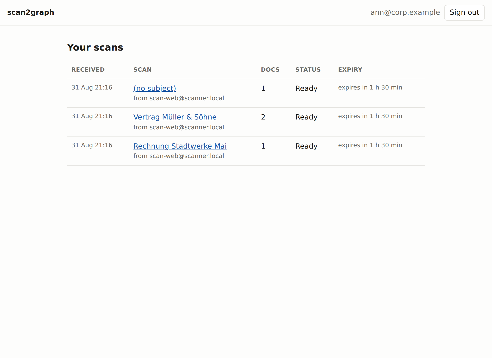
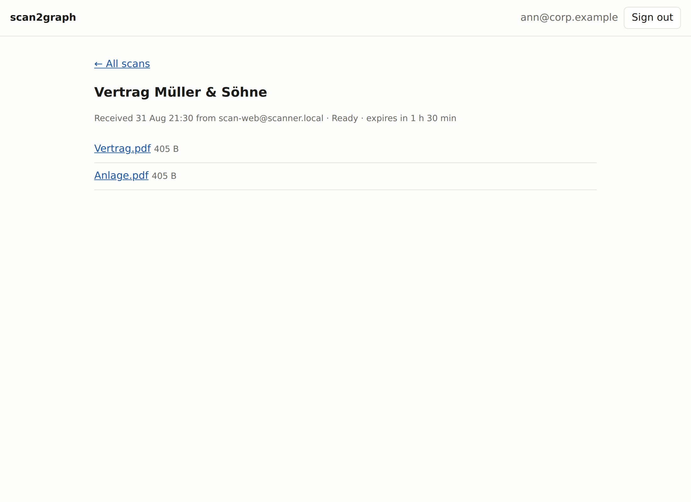
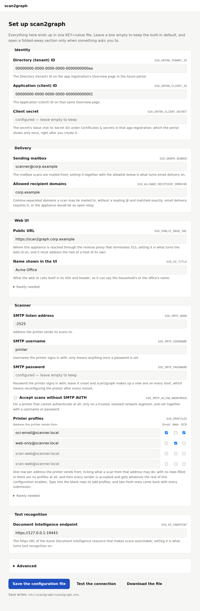
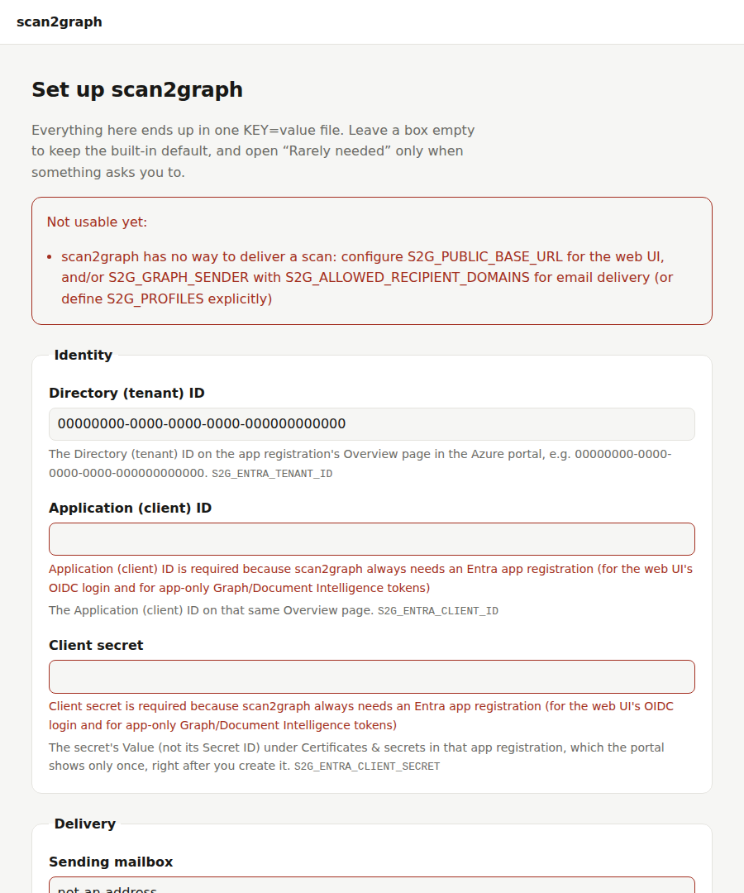
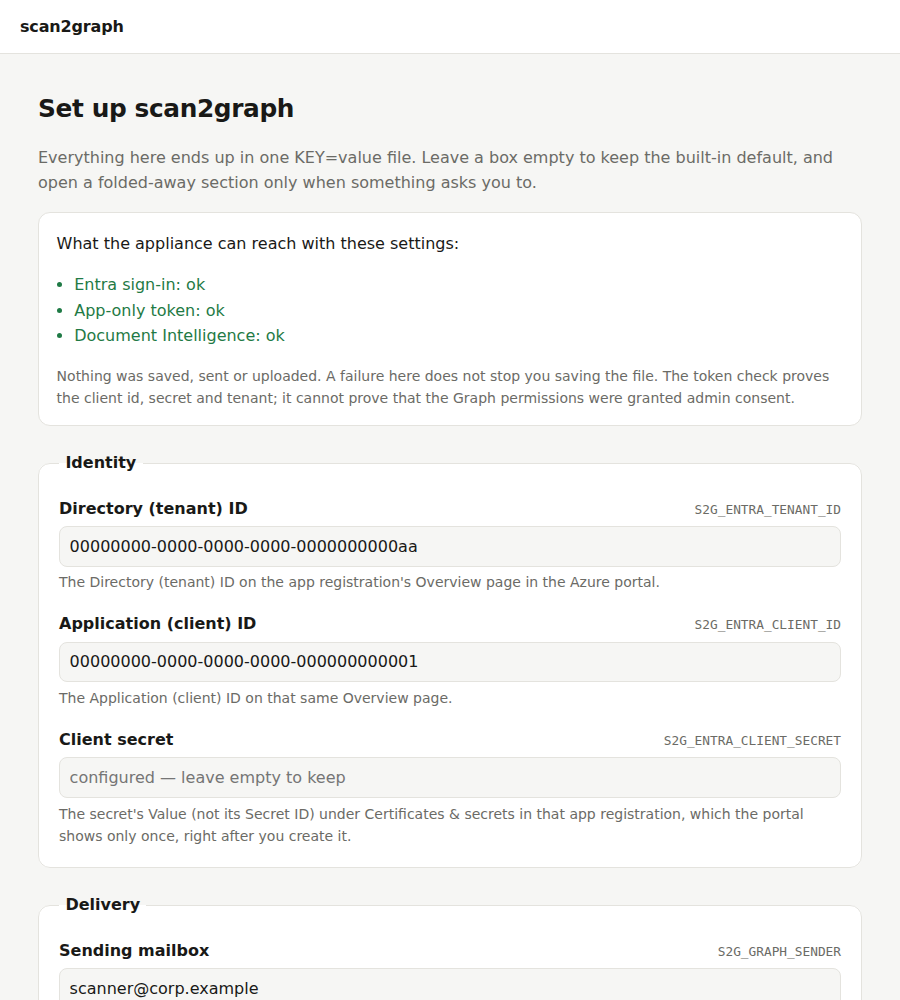
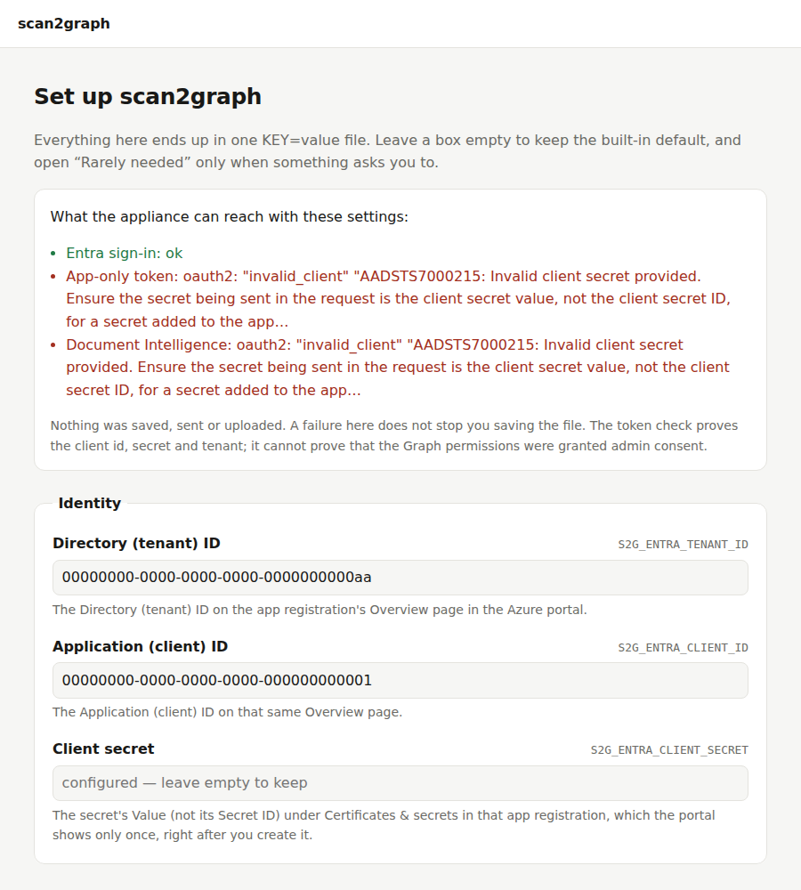
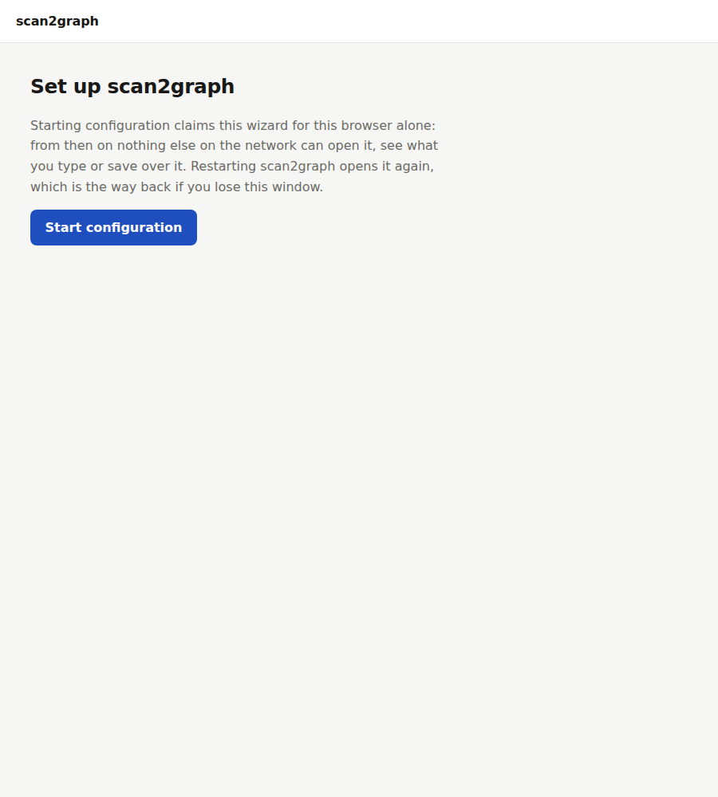

# scan2graph

A small, self-contained LAN gateway that turns "scan to email" from old
printers/scanners into modern document delivery: it accepts the printer's SMTP
message, extracts the PDF attachments, optionally runs them through Azure
Document Intelligence OCR (searchable PDF), and then either sends them onwards
with Microsoft Graph, exposes them temporarily in a small Entra-authenticated
web UI, or both.

Many multifunction printers can only speak unauthenticated SMTP to a server on
the local network. Microsoft 365 no longer accepts that. scan2graph is the
missing piece in between — one container, no database, no queue, no persistent
state.

## How it works

```
┌─────────┐  SMTP :25→:2525   ┌──────────────────────┐  Azure Document Intelligence
│ printer │ ────────────────► │                      │ ◄──► prebuilt-read, searchable PDF
└─────────┘                   │      scan2graph      │
                              │  (single container)  │  Microsoft Graph
┌─────────┐  HTTPS            │                      │ ◄──► sendMail (MIME)
│ browser │ ──► reverse proxy ─► HTTP :8080          │
└─────────┘     (TLS here)    └──────────────────────┘
```

1. The printer sends the scan to scan2graph over plain LAN SMTP.
2. The **SMTP envelope sender** selects a *sender profile*, i.e. what should
   happen with the scan.
3. The **SMTP envelope recipients** identify the *people* the scan is for.
4. PDFs are extracted, optionally OCRed, and then mailed via Microsoft Graph
   and/or offered for download in the web UI for a limited time.





## Sender profiles vs. recipient identity

Printers usually offer two independent address books: the "from" address of the
device and a list of destination addresses. scan2graph uses them for two
different purposes, and it never looks at the MIME `From:`/`To:` headers.

* **Envelope sender → feature profile.** Configure one printer sender address
  per feature combination, for example `scan-web-ocr@scanner.local`. Once
  profiles are configured, unknown senders are rejected. Profiles are
  optional: with none configured, every sender gets the same treatment, and
  each capability is on exactly when the configuration it needs is present —
  email once a Graph sender and a recipient-domain allowlist are configured,
  web downloads once the public base URL is, OCR once the Document
  Intelligence endpoint is. scan2graph prints the resulting profile at
  startup, so it is never a mystery why a feature is off.
* **Envelope recipients → users.** The recipient addresses are matched against
  the signed-in Entra user's email / UPN.

A profile is a combination of three independent capabilities:

| capability | effect                                                        |
| ---------- | ------------------------------------------------------------- |
| `ocr`      | run each PDF through Azure Document Intelligence (searchable PDF) |
| `email`    | send the resulting PDFs via Microsoft Graph to the recipients  |
| `web`      | make the resulting PDFs downloadable in the web UI for a while |

```json
{
  "scan-email-ocr@scanner.local": { "email": true,  "web": false, "ocr": true  },
  "scan-web-ocr@scanner.local":   { "email": false, "web": true,  "ocr": true  },
  "scan-web@scanner.local":       { "email": false, "web": true,  "ocr": false }
}
```

The recipient-domain allowlist (`S2G_ALLOWED_RECIPIENT_DOMAINS`) is checked
for every recipient of every profile, not only the ones a profile ends up
emailing — a web-only scan to someone outside the allowed domains is rejected
at SMTP time just the same. It is only *required* when something can send
email, though: a web-only deployment that leaves it unset accepts any
recipient address at all, which is fine for a printer on your own LAN but
not a filter you have configured.

## Setting up the printer

Point the printer's "scan to email" feature at scan2graph:

* **SMTP server**: scan2graph's host, on the LAN.
* **Port**: whatever `S2G_SMTP_ADDR` listens on (`2525` by default — scan2graph
  runs unprivileged and cannot bind port 25 itself; forward it at the network
  layer if the printer insists on 25).
* **Encryption**: none. The listener never advertises STARTTLS; see "Security
  assumptions" for why that is an accepted trade-off on a LAN segment.
* **Authentication**: PLAIN or LOGIN, with `S2G_SMTP_USERNAME` /
  `S2G_SMTP_PASSWORD` (username defaults to `scanner`; leaving the password
  unset makes scan2graph generate a fresh one and print it on every start,
  which is fine for trying things out but not for a printer profile you want
  to survive a restart). `S2G_SMTP_ALLOW_ANONYMOUS=true` turns AUTH off
  entirely — only do that on a fully trusted, isolated segment.
* **From address**: this is the sender-profile address from the table above —
  configure one printer "scan to" button per feature combination you want.
* **To address(es)**: the recipients — see "Sender profiles vs. recipient
  identity" above.

The printer's own "test connection" button sends a message with nothing
attached; scan2graph accepts it and logs it, so a working setup does not
report a failure on the device's panel. A message that *does* carry
attachments but no usable PDF is still refused with `550` — that is a
printer set to JPEG or TIFF, and the refusal is the only way it gets told.

## Entra ID app registration

scan2graph needs exactly one Entra app registration. It serves both the web
UI's sign-in (authorization code flow with PKCE) and the app-only tokens used
to call Microsoft Graph and Azure Document Intelligence (client credentials
flow) — there is nothing to register twice. Steps 1 and 3 are always needed;
the rest depend on what your profiles actually do.

1. **Microsoft Entra ID → App registrations → New registration.** A
   single-tenant app is enough. Note the **Directory (tenant) ID** and
   **Application (client) ID** from the Overview page —
   `S2G_ENTRA_TENANT_ID` and `S2G_ENTRA_CLIENT_ID`.
2. **Only if a profile offers web downloads** (i.e. you configure
   `S2G_PUBLIC_BASE_URL`): **Authentication → Add a platform → Web**,
   redirect URI `https://<your host>/auth/callback` (that base URL plus
   `/auth/callback`, exactly). Use the **Web** platform, not SPA or a public
   client — scan2graph holds a client secret and runs the code exchange
   server-side. An email-only deployment signs nobody in and needs no
   redirect URI at all.
3. **Certificates & secrets → New client secret.** The value is shown once;
   copy it into `S2G_ENTRA_CLIENT_SECRET` (or, preferably,
   `S2G_ENTRA_CLIENT_SECRET_FILE`).
4. **Only if a profile sends email** (i.e. you configure `S2G_GRAPH_SENDER`):
   **API permissions → Add a permission → Microsoft Graph → Application
   permissions → `Mail.Send`**, then **Grant admin consent**. This is what
   lets scan2graph's app-only token call `sendMail`. A web-only deployment
   never constructs a mailer and should not be granted it. Sign-in itself
   needs no extra permission either: it only requests the standard OIDC
   `openid`, `profile` and `email` scopes, none of which need consent.
5. **Only if a scan can be larger than 2.2 MB**: add `Mail.ReadWrite` next to
   it and consent to that as well. One `sendMail` request carries at most
   4 MB, and two rounds of base64 eat all but about 2.2 MB of that before the
   first page — so past that size scan2graph creates the mail as a draft,
   streams the attachment into it in 3.75 MB chunks and sends the draft, and
   writing a draft is a write to the mailbox rather than a send. Nothing
   breaks without it: a scan over the ceiling gets the same "too large"
   notice it gets today, so a deployment whose scans are small keeps the
   narrower permission. scan2graph reads its own token at startup, logs which
   ceiling it ended up with, and prints a banner if it will accept scans over
   SMTP that it would then have to refuse.

**Scope the mail permissions to the one mailbox.** As granted they are
tenant-wide: `Mail.Send` lets the app send as anybody, and `Mail.ReadWrite`
lets it read and rewrite every mailbox in the tenant — for an appliance that
only ever writes one draft in one mailbox, that is a lot of authority sitting
on a client secret in a container. Exchange Online has one lever that closes
it, and it takes five minutes:

```powershell
Connect-ExchangeOnline
New-ApplicationAccessPolicy -AppId <application (client) id> `
  -PolicyScopeGroupId scanner@example.com `
  -AccessRight RestrictAccess `
  -Description "scan2graph may only use the scanner mailbox"
Test-ApplicationAccessPolicy -AppId <application (client) id> `
  -Identity someone.else@example.com
```

Use the address in `S2G_GRAPH_SENDER` as the scope, and a mail-enabled
security group instead if you ever need more than one. The policy can take
up to an hour to take effect; `Test-ApplicationAccessPolicy` is how you know
it did — it must answer `Denied` for a mailbox that is not the scanner's and
`Granted` for the one that is.

## Azure Document Intelligence

1. Create a **Document Intelligence** resource in the Azure Portal. Its
   endpoint, from the resource's Keys and Endpoint page, is
   `S2G_DI_ENDPOINT` (must be `https`).
2. scan2graph authenticates with the same app registration's app-only token,
   never a resource key, so the app registration needs the built-in
   **Cognitive Services User** role on that resource: resource → **Access
   control (IAM) → Add role assignment → Cognitive Services User**, assigned
   to the app registration by name. With that in place you can turn the
   resource's local (key-based) authentication off entirely.

## Reverse proxy

scan2graph never terminates TLS and never manages certificates — put a
reverse proxy (nginx, Caddy, Traefik, an existing ingress, ...) in front of
the HTTP port for that. Two things it has to get right:

* Give scan2graph **its own hostname** and proxy all of it — not a path
  prefix under an existing site. `S2G_PUBLIC_BASE_URL` must address the root
  of a host (it is what the OIDC redirect and every link on the page are
  built from); scan2graph refuses to start with a path in it.
* No forwarded-header handling is required: scan2graph never derives a URL
  from the incoming request, only from `S2G_PUBLIC_BASE_URL`.

## Configuration reference

Every `S2G_X` variable below may instead be set as `S2G_X_FILE`, pointing at
a file whose contents (trailing whitespace trimmed) become the value — the
way to feed in a secret via a Docker secret file without it ever being a
plain environment variable. Setting both at once is a startup error. See
[`.env.example`](.env.example) for a fully commented copy with example
values.

**A configuration file.** The same settings can live in a `KEY=value` file —
the format of `.env.example` — which scan2graph reads when it is pointed at
one:

```bash
scan2graph --config /etc/scan2graph/scan2graph.env
S2G_CONFIG_FILE=/etc/scan2graph/scan2graph.env scan2graph
```

There is deliberately no default location: nothing is read unless a path is
given, and a path that cannot be read or parsed stops startup rather than
falling back. Precedence is **environment variable > file > built-in
default**, per setting rather than per spelling: `S2G_X` in the environment
also overrides an `S2G_X_FILE` line in the file, and vice versa. Startup logs
which file was read and names any of its settings the environment overrode,
so a setting that is being ignored says so by name.
Comment lines (`#`), blank lines, an `export ` prefix and single- or
double-quoted values are all accepted; a duplicate key is an error. Only
`S2G_*` settings come from the file — `S2G_CONFIG_FILE` itself and anything
the Go runtime reads directly (`SSL_CERT_FILE`, `HTTPS_PROXY`, `TZ`) must be
real environment variables.

**Listeners, logging & appearance**

| variable | default | required when |
| --- | --- | --- |
| `S2G_HTTP_ADDR` | `:8080` | — |
| `S2G_SMTP_ADDR` | `:2525` | — |
| `S2G_TEMP_DIR` | the OS temp directory | — |
| `S2G_LOG_LEVEL` | `info` | — |
| `S2G_LOG_FORMAT` | `json` | — |
| `S2G_UI_TITLE` | `scan2graph` | — |

**SMTP AUTH**

| variable | default | required when |
| --- | --- | --- |
| `S2G_SMTP_USERNAME` | `scanner` | only meaningful once a password is set |
| `S2G_SMTP_PASSWORD` | none — an ephemeral password is generated and printed on every start | set it for a deployment that must keep working across restarts |
| `S2G_SMTP_ALLOW_ANONYMOUS` | `false` | mutually exclusive with the two above |

**Sender profiles & recipients**

| variable | default | required when |
| --- | --- | --- |
| `S2G_PROFILES` | none — the default profile applies to every sender | — |
| `S2G_ALLOWED_RECIPIENT_DOMAINS` | none | any profile (or the default profile) has `email` enabled |
| `S2G_PUBLIC_BASE_URL` | none — web UI disabled | any profile (or the default profile) has `web` enabled |

**Entra ID (identity) — always required**

| variable | default | required when |
| --- | --- | --- |
| `S2G_ENTRA_TENANT_ID` | none | always |
| `S2G_ENTRA_CLIENT_ID` | none | always |
| `S2G_ENTRA_CLIENT_SECRET` | none | always |
| `S2G_ENTRA_AUTHORITY_URL` | derived from the tenant id | override only to point at a local test IdP |
| `S2G_ENTRA_TOKEN_URL` | derived from the tenant id | override only to point at a local test IdP |

**Microsoft Graph**

| variable | default | required when |
| --- | --- | --- |
| `S2G_GRAPH_BASE_URL` | `https://graph.microsoft.com/v1.0` | — |
| `S2G_GRAPH_SCOPE` | `https://graph.microsoft.com/.default` | — |
| `S2G_GRAPH_SENDER` | none | any profile (or the default profile) has `email` enabled |

**Azure Document Intelligence**

| variable | default | required when |
| --- | --- | --- |
| `S2G_DI_ENDPOINT` | none | any profile (or the default profile) has `ocr` enabled; must be `https` |
| `S2G_DI_API_VERSION` | `2024-11-30` | — |
| `S2G_DI_SCOPE` | `https://cognitiveservices.azure.com/.default` | — |

**Lifetimes & limits**

| variable | default | required when |
| --- | --- | --- |
| `S2G_JOB_TTL` | `8h` (minimum `1m`) | — |
| `S2G_MAX_MESSAGE_BYTES` | `33554432` (32 MiB) — the SMTP DATA cap, which also bounds PDF size | — |
| `S2G_MAX_JOBS` | `32` — queued + in-flight + web-visible jobs | — |
| `S2G_MAX_CONCURRENT_JOBS` | `2` — pipeline workers, also the OCR concurrency cap | — |

A message's MIME structure has its own, non-configurable ceiling (at most 100
parts, 10 levels of nesting, 16 PDF attachments); a message over any of these
is rejected with SMTP `552`, the same code a too-large message gets.

What can be *emailed* is a second ceiling, not this one: with
`Mail.ReadWrite` granted, `S2G_MAX_MESSAGE_BYTES` is the limit scan2graph
imposes, and the mailbox's own — 35 MB unless the tenant changed it — is the
one behind it; without the permission, one message carries about 2.2 MB. See
the app registration section above for what it buys and how scan2graph
reports which of the two you are on.

## Run modes and the setup wizard

`scan2graph` (no subcommand) is the normal way to start it: with a
configuration that loads, it serves the appliance, exactly like
`scan2graph serve` always does. The difference only shows up on a first
boot, before the appliance has an Entra app registration or a password of
its own, where it instead serves a small web form at `S2G_HTTP_ADDR`
(`:8080` by default) that writes the same `KEY=value` file the configuration
reference above describes: fill it in, save, and restart `scan2graph` for
real — the wizard never restarts anything itself.



Whatever the appliance rejects, the form rejects, because it validates by
asking the real loader: the answers go through the same precedence and the
same rules a start would apply, and the complaints come back against the
boxes that caused them.



**Test the connection** is the third button, and the only thing in the wizard
that talks to Microsoft. Three lines come back, each bounded and none of them
sending, uploading or saving anything:

* **Entra sign-in** — the OIDC discovery the web UI's login needs, against the
  authority in the form.
* **App-only token** — one client-credentials token, which proves the client
  ID, the secret and the tenant. It always runs, because every configuration
  has that credential and nothing else here spends it. It does not prove that
  the Graph permissions were granted admin consent: Entra mints `.default` for
  any app in the tenant, and the Graph call that would show consent needs
  `User.Read.All`, which a correctly scoped app registration does not have.
* **Document Intelligence** — a token for that resource and a real read of its
  model list, which proves the endpoint, the TLS chain, the token and the
  scope together. Not run when text recognition is off.



What comes back on a failure is Entra's own sentence —
`AADSTS7000215: Invalid client secret provided` is what tells you that you
pasted the secret's ID instead of its Value, which the configuration file alone
can never look wrong for. A failure is advice, not validation: a tenant this
network cannot reach yet is still a configuration worth writing, so Save keeps
working either way.



That first-boot form is deliberately **unauthenticated** — nothing is
configured yet, so there is nothing on the appliance to steal or hijack —
which makes it something to run on a **trusted network only**, the same LAN
segment the printer already sits on, never across the open internet. What it
opens on is a single **Start configuration** button, and the first browser to
press it claims the wizard: that browser is handed a cookie, and every other
client on the network gets the same 404 everything unauthorized gets, so
nothing can read what you type into the form or save over it. Lose that cookie
— the wrong browser, a private window closed — and there is no way back in
until scan2graph is restarted, which re-opens the form because a fresh install
still has nothing to protect.



Two more entry points reach the same form once something is already
configured, without exposing that unauthenticated door on a running
appliance:

* `scan2graph setup [--config …]` starts it in the foreground on purpose, to
  fix a typo or add a missing setting without an editor and a shell. Once
  anything worth protecting is configured — the Entra app registration or
  either secret, or a configuration file that will not parse, since then
  nobody can say what it holds — it mints a one-shot token of its own and
  prints the URL to open, token included, on **stderr**: the form's Download
  button hands back that whole file, client secret and all, and its Save
  button writes a replacement over it. A first boot, where there is nothing
  to give away, needs no token.
* `scan2graph setup-next-start --config /etc/scan2graph/scan2graph.env`
  mints a one-shot token, prints the URL to open — token included — to
  **stderr**, where a redirected stdout cannot swallow the only copy of it,
  and exits. The token gates the form the *next* time `scan2graph` starts
  with no subcommand instead of serving the appliance — a file that will not
  parse included, which is the repair that entry point exists for — and it is
  gone, used or not, the instant that start reads it: nothing usable is ever
  left on disk in between.

Either way the form offers both **Save** and **Download**, and a container
running with a read-only root filesystem has to use Download: Save writes the
configuration file in place, which such a container cannot do.

## Deployment

```bash
cp .env.example .env   # then edit it — see the reference above, or use the setup wizard
docker compose -f docker-compose.example.yml up -d
```

Copy [`docker-compose.example.yml`](docker-compose.example.yml) and edit it —
every setting in it is commented, including the config-file alternative to
`env_file`. Building the image yourself is `docker build -t scan2graph .`.

**Running under systemd instead.** scan2graph is a single static binary, so
a container is not required — a unit works just as well on a host that
already runs one:

```bash
CGO_ENABLED=0 go build -o /usr/local/bin/scan2graph ./cmd/scan2graph
useradd --system --no-create-home --shell /usr/sbin/nologin scan2graph

mkdir -p /etc/scan2graph
cp .env.example /etc/scan2graph/scan2graph.env   # then edit it
chown -R scan2graph:scan2graph /etc/scan2graph   # saving replaces by rename
chmod 0600 /etc/scan2graph/scan2graph.env

cp scan2graph.example.service /etc/systemd/system/scan2graph.service
systemctl daemon-reload
systemctl enable --now scan2graph
```

The unit runs `serve`, which never opens the wizard, so `setup-next-start`
— which only arms the *next* start with no subcommand — would do nothing
here. Under systemd the wizard is a run of its own instead: stop the unit to
free the port, run it as the service user so what it writes stays owned by
the service, and start the unit again afterwards.

```bash
systemctl stop scan2graph
sudo -u scan2graph /usr/local/bin/scan2graph setup \
  --config /etc/scan2graph/scan2graph.env
# fill the form in, save, then Ctrl-C
systemctl start scan2graph
```

That prints the URL to open — one-shot token included, whenever the file
already holds something worth protecting — to stderr; see "Run modes and the
setup wizard" above. **Save** works here precisely *because* this run is
outside the unit: the service itself may not write `/etc` at all.

**Hardening.** `ProtectSystem=strict` makes the unit's whole file hierarchy
read-only to it, which is exactly right for an appliance with no state of
its own to keep — the one directory it does write to, `S2G_TEMP_DIR`, is the
private `/tmp` `PrivateTmp=yes` gives it inside the service's own mount
namespace, so pointing that setting anywhere else fails at runtime. The
empty `CapabilityBoundingSet` works because both listeners sit above port
1024, and `RestrictAddressFamilies=AF_INET AF_INET6` is why the build above
is CGO-free: a cgo build resolves names through NSS, which on a host running
systemd-resolved means a unix socket the unit is not allowed to open.

## Security assumptions

* The SMTP listener is meant for a **restricted LAN segment** and speaks
  plain TCP without TLS, because that is all these devices can do. It does
  support SMTP AUTH (PLAIN/LOGIN); if you do not configure credentials,
  scan2graph generates an ephemeral password at startup and prints it.
  Running without authentication is possible but has to be opted into
  explicitly. Incoming data is treated as untrusted regardless, and is
  subject to strict size, nesting and count limits.
* scan2graph is **not** a mail relay: it only ever sends *new* messages it
  composed itself, to envelope recipients that pass the mandatory
  recipient-domain allowlist.
* The web UI requires Entra sign-in; every job and document request
  re-checks, server-side, that the signed-in user was an envelope recipient
  of that scan. Unguessable IDs in the URLs are a defence-in-depth measure,
  never the authorization mechanism.
* The app registration's `Mail.Send` application permission — and
  `Mail.ReadWrite`, where large scans are wanted — reach every mailbox in the
  tenant by default; an Exchange Online application access policy scoping the
  app to `S2G_GRAPH_SENDER` closes that gap, and the recipe for it is in the
  app registration section above.
* HTTPS, HSTS and the public hostname are the reverse proxy's job.

## Data retention and failure semantics

scan2graph is intentionally **ephemeral**. Once the printer has received SMTP
`250`, that only means the scan was *accepted*, not delivered: from there it
lives only in this process — in-memory metadata plus temporary files owned by
the application. There is no database, no durable queue and no persistent
volume.

If the container crashes or is restarted before delivery, the scan is gone
and the document has to be scanned again. That is a deliberate trade-off for
an appliance that otherwise needs zero operational care — the paper original
is still lying on the scanner glass.

Web-visible scans expire `S2G_JOB_TTL` (8 hours by default) after the
pipeline finishes with them — ready or failed — rather than from when the
printer sent them. OCR can take a while, and failing takes longer still
because every retry has to be spent first; measured from arrival, a scan
could otherwise be finished and expired in the same instant. Email-only
scans are deleted immediately after successful delivery.

A failed job is not silent. Its status and a short, user-safe reason show in
the web UI whenever the profile has `web`, and its recipients get a notice
email whenever the profile has `email` — never the underlying error, a path
or a token. Two failure modes are worth calling out specifically:

* When OCR fails on a job that also has `web`, the job is marked failed but
  the original, not-searchable scan stays downloadable for the rest of its
  TTL rather than being lost outright; the notice email (if any) links to it.
  scan2graph never silently substitutes the original for a searchable PDF it
  failed to produce — the failed status and reason say so plainly.
* A scan too large for Graph to send — see "Lifetimes & limits" above for
  what that ceiling is — is not treated as a failure: the recipients get a
  notice instead, with a download link when the profile has `web`, or advice
  to rescan at a lower resolution when it does not.

## Non-goals

No database, no durable queue, no message broker, no Azure/Graph SDKs, no SPA
or frontend build pipeline, no PDF rendering stack, no admin UI, no generic
SMTP relaying, and no HTTPS/ACME handling of its own — container or systemd,
that is always the reverse proxy's job.

## Development & tests

```bash
go build ./...
go test ./...
go test -race ./...
docker build -t scan2graph .
```

The end-to-end suite drives the real `scan2graph` binary through a real
browser (Playwright, Chromium) and a real SMTP socket, against local fakes
for Entra, Azure Document Intelligence and Microsoft Graph:

```bash
cd e2e
npm ci
npx playwright install --with-deps chromium
npm test
```

It builds and starts both the appliance and the fakes itself — nothing needs
to be running beforehand.

## License

MIT — see [LICENSE](LICENSE).
