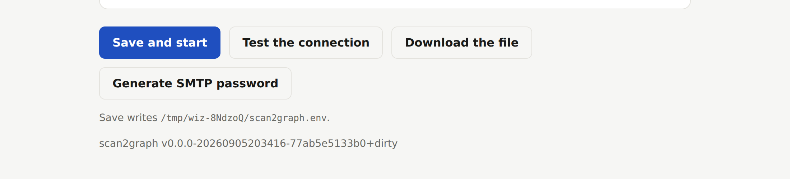

# Versioning

scan2graph uses semantic versioning, with git tags as the only source of
truth. There is no version file, no version-bumping tool and no release bot:
the Go toolchain already derives a version from the nearest tag, so a tag is
all the state a release needs.

## Cutting a release

```sh
git switch master && git pull
git tag -a v0.2.0 -m "v0.2.0"
git push origin v0.2.0
```

Pushing the tag is the release. `.github/workflows/release.yml` fires on
`v*` and publishes `ghcr.io/georg-jung/scan2graph` at `{{version}}`,
`{{major}}.{{minor}}` and — for a tag without a prerelease suffix — `latest`,
multi-arch, with an SBOM and build provenance.

Nothing else publishes an image. Commits on master are not released.

## What the version means

MAJOR is the appliance's configuration contract, not a Go API: the `S2G_*`
names and their defaults, the configuration file format, the `/config` volume
layout, the subcommands, and the default ports. Breaking any of those is a
major bump. Adding a setting with a working default is a minor one.

While the version is `0.x`, that promise is not in force yet — semver's own
rule for 0.x — because the configuration surface is still moving. Declaring
`v1.0.0` is the moment it starts.

## Where the version comes from

`internal/version` answers, in two ways:

- **Container images** get it stamped in at link time. They have to:
  `.dockerignore` keeps `.git` out of the build context, so the toolchain has
  no repository to look at. `release.yml` passes the tag as the `VERSION`
  build argument and the Dockerfile links it into `version.Stamp`.
- **Everything else** derives it from the module's own build info, with no
  flags and no tooling:

  | build | reports |
  | --- | --- |
  | `go install …/cmd/scan2graph@v0.2.0` | `v0.2.0` |
  | `go build` on the tag | `v0.2.0` |
  | `go build`, 3 commits later | `v0.2.1-0.20260906093111-3faaf5bdda41` |
  | `go build`, uncommitted changes | the same, plus `+dirty` |
  | `go build` from a source archive | `unknown` — there is no repository to read |

  That last row is the one that catches people: a GitHub "Download ZIP" has no
  `.git`. Clone, or `go install` a tagged version.

An operator reads it with `scan2graph --version`, in the startup log line, or
in the setup wizard's footer:



## The tax at v2

Go requires the module path itself to carry the major version from v2 onward.
Tagging `v2.0.0` without doing that does not fail — it is worse than that,
it is silent: the toolchain ignores the tag, so the binary reports
`v1.0.1-0.2026…` while sitting exactly on `v2.0.0`, and
`go install …@latest` keeps serving the newest v1 forever.

So a major bump to v2 or beyond is a commit, made together with the tag:

1. `go.mod`: `module github.com/georg-jung/scan2graph/v2`
2. Every internal import of that path — 20 files today.
3. `Dockerfile`: the `-X` flag names the package by its full path, so
   `…/scan2graph/internal/version.Stamp` becomes
   `…/scan2graph/v2/internal/version.Stamp`. Miss this one and the image
   silently falls back to the derived version, which inside the container is
   `unknown`.
4. README's `go install` line.

Verify with `go build -o /tmp/s2g ./cmd/scan2graph && /tmp/s2g --version`
before pushing the tag: it must print `v2.0.0`, not a `v1.x` pseudo-version.

Well-run Go projects split on whether to pay this. Prometheus and Syncthing
skip it — Syncthing ships v2.1.3 while `go install …@latest` hands out a v1
from over a year earlier, and Prometheus maintains a parallel `v0.314.0` tag
series so the module system has something to resolve. `gh`, Caddy, Traefik,
GoReleaser and golangci-lint all pay it. scan2graph pays it: it is 20 files
here rather than thousands, and both `go install` and the startup banner are
paths this appliance actually depends on.
